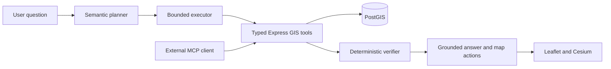

# QueueLens Agent

**A Tool-Augmented Spatial AI Agent for Healthcare Accessibility**

**English** | [简体中文](README.zh-CN.md)

```text
Natural Language
       ↓
Spatial Agent
       ↓
Plan → GIS Tools → PostGIS → Verify
       ↓
Grounded Answer + Interactive Map
```

QueueLens extends the existing Hospital WebGIS with typed spatial tools, a bounded Python agent, deterministic verification, map commands, MCP and executable evaluation. LLMs extract semantic intent; PostGIS and deterministic software calculate facts.

**本地实现与真实模型实验已完成。** [原WebGIS演示](https://hospital-queue-webgis.onrender.com)尚未部署本次Agent升级。新增实验说明使用中文；规则回归与真实模型结果分开报告。

## 真实模型实验（本阶段已完成）

deepseek-flash；dev 120、validation 60、冻结test 180。test四系统各三次独立推理，共2160条逐case结果，全部失败保留；120/120规则结果继续单列为Development / Regression Benchmark。

| System | 三次平均 E2E | Severe Error Rate |
|---|---:|---:|
| LLM Only | 27.22% | 62.22% |
| Text-to-SQL | 42.04% | 34.26% |
| Single-Step | 31.48% | 42.96% |
| Proposed | 93.15% | 0.56% |

本结果来自12家合成医院、45条报告与独立PostGIS oracle；unseen仅指相对于项目开发/validation未用于调参的语言与组合。三次均值、Pass@1、槽位准确率、一致性、token、权限差异、失败与限制见[中文实验报告](eval/reports/LLM_EXPERIMENT_RESULTS_ZH.md)。模型没有训练；原公共demo尚未部署本次升级。

[中文失败分析](docs/FAILURE_ANALYSIS_ZH.md) · [项目最终总结](docs/FINAL_PROJECT_SUMMARY_ZH.md) · [中文简历/面试材料](docs/RESUME_MATERIAL_ZH.md)

QueueLens 不提供医疗诊断、紧急程度判断或临床适宜性建议。

QueueLens 当前阶段开发冻结。后续仅进行必要 bug fix、依赖维护或针对实际岗位需求的小规模适配，不再继续增加 RAG、Multi-Agent 或其他非必要功能。


## Problem

Hospital accessibility questions combine location, temporal observations and multiple constraints: “Find three hospitals within 2 km with shorter average queues during the last 24 hours and cleanliness at least 4.” A useful answer must identify real candidates, aggregate the requested window, filter missing/insufficient evidence, rank the eligible hospitals and update the map.

## Why LLM-only GIS fails

A language model does not hold the application's current report table or an executable spatial index. Distance, radius membership, ranking, aggregation and database facts must be retrieved and computed. QueueLens's model produces a validated semantic plan; it does not supply numeric hospital facts or overwrite tool results.

## Architecture



The existing Express API, repositories, GeoJSON, report workflow, Chart.js, Leaflet and Cesium remain. FastAPI is a separate optional service. Tools use the canonical Node schemas and parameterized SQL. [Full architecture](docs/ARCHITECTURE.md) · [Repository audit and phased plan](docs/REPOSITORY_AUDIT.md)

| Stage | Implemented locally |
|---|---|
| P0 | Full repository audit and file-level upgrade plan |
| P1 | Eight typed, evidence-preserving GIS tools; incremental schema/index migration |
| P2–P3 | Configurable model adapter, bounded Plan–Execute–Verify, sessions, SSE, grounded templates |
| P4 | Shared map contract, Leaflet/Cesium adapters and optional Agent UI |
| P5 | Actual stdio MCP server sharing the same tools |
| P6 | 120-case independent oracle/scorer, baseline adapters, failure taxonomy and CI configuration |
| P7 | Reproduction/deployment documents, example trace, screenshots and dependency locks |

Configured CI and Docker files are source artifacts. Remote GitHub Actions execution, Docker build and production deployment are not claimed as completed experiments.

## Example Agent trace

```text
“找2000米以内最近24小时平均排队较短，并且清洁度至少4分的三家医院。”
→ search_nearby_hospitals: PostGIS radius and distance ordering
→ rank_hospitals: [start,end) aggregation, score filter, then top-k
→ verify: evidence, window, candidate membership, filters and global candidate ranking
→ grounded facts + filter / fit_bounds / highlight / rank / open_popup
```

The [recorded synthetic trace](docs/EXAMPLE_TRACE.json) is extracted from an actual local PostGIS rule-mode run. Referents such as “第二个过去24小时怎么样？” use the previous verified entity order and execute fresh tools. Sessions and locations expire; invalid references return explicit errors.

## Spatial tools

| Tool | Capability |
|---|---|
| resolve_hospitals | Exact-first name resolution; explicit ambiguity |
| search_nearby_hospitals | Spheroidal nearest/radius query, bounded results and completeness flag |
| get_hospital_details | Typed hospital/latest observation |
| get_hospital_reports | Bounded reports in an explicit time window |
| get_queue_statistics | Counts, ordinal severity and observed wait minutes |
| get_cleanliness_statistics | Numeric observed scores with sample counts |
| compare_hospitals | Same-window batch comparison |
| rank_hospitals | Complete-candidate deterministic weighted ranking after filters |

`GET /api/tools/catalog` publishes strict schemas; `POST /api/tools/:name` executes an allowlisted tool. Numeric scores and observed wait minutes are optional report fields. Historic descriptions remain text; Unknown and missing values are not guessed. [Contracts/formula/limits](docs/SPATIAL_TOOLS.md)

## Map interaction

One [map action schema](contracts/map-actions.schema.json) supports fit_bounds, highlight, filter, rank, compare, open_popup and fly_to. The browser validates the complete batch before execution; every ID comes from verified final entities. Popups render text. Only opaque session IDs persist across navigation; cached factual answers are not replayed.


[Map behavior and browser validation](docs/MAP_ACTIONS.md)

## MCP

```bash
python -m pip install -r mcp/requirements.txt
python mcp/server.py
```

Set `GIS_API_URL` to the trusted Node API. The stdio MCP bridge reuses ToolClient and the canonical catalog; it contains no second SQL/GIS implementation and exposes no write or arbitrary SQL tool. Actual initialize/list/call protocol tests cover all eight tools. [Client configuration](docs/MCP.md)

## Benchmark

120 deterministic synthetic queries cover lookup, nearest, radius, filters, spatial attributes, time windows, ranking, comparison, multi-step, follow-up, ambiguity, no-result and invalid requests. Ground truth reads raw database rows and PostGIS distances independently of the agent tools. Scores include tool selection/arguments, execution, constraints, entities, groundedness, map actions, end-to-end success, latency and call count.

**Rule-mode PostGIS workflow regression:** Proposed rules 120/120; one-tool rules 50/120. These numbers validate the known-template software workflow; they do not measure LLM reasoning or unseen-language accuracy. [Actual reports and metric definitions](docs/EVALUATION.md) · [Results](eval/reports/RESULTS.md)

## Baseline comparison

四组真实模型实验已完成。A无工具/数据库；B使用隔离只读PostGIS、AST白名单和固定事实投影；C只允许一个GIS调用；D执行Plan–Execute–Verify。共享模型、时钟、fixture与冻结test，能力差异包含信息访问和工程约束，不全部归因模型推理或verifier。[完整结果与公平性边界](eval/reports/LLM_EXPERIMENT_RESULTS_ZH.md)

## Failure analysis

The [failure taxonomy and representative cases](docs/FAILURE_ANALYSIS.md) include invalid plans/arguments, wrong windows/radii, missing data, ambiguity, referents, malformed outputs, execution failures, verification, map failures and excessive calls. A real Python/Node timestamp-precision failure found in browser testing is recorded with its repair and regression test.

## Deployment

Existing WebGIS only:

```bash
npm ci
npm start
# Optional persistent stack:
docker compose up --build
```

Optional Agent: use Python 3.12, install `agent-service/requirements.lock.txt`, export its example environment variables, and start `python -m uvicorn app.main:app --host 127.0.0.1 --port 8000` from `agent-service`. Set Node's `AGENT_SERVICE_URL` and restart Node. Default `http_chat` requires `LLM_BASE_URL`, `LLM_MODEL` and `LLM_API_KEY`; explicit `PLANNER_PROVIDER=rules` is a labelled zero-key demo.

```bash
docker compose -f docker-compose.yml -f docker-compose.agent.yml --profile agent up --build
```

The Agent panel is hidden when the service URL is unset. Tokens stay server-side. [Complete configuration and deployment limits](docs/DEPLOYMENT.md)

## Reproduction

Install root `requirements.lock.txt` in a Python 3.12 virtual environment for Agent/MCP/evaluation tests.

```bash
npm test
# From agent-service:
python -m pytest tests -q
# From repository root:
python -m pytest eval/tests -q
python eval/evaluator.py --store memory --offline --require-smoke-pass --output eval/reports/run-memory.json
```

PostGIS evaluation requires the isolated queuelens_test/queuelens_eval databases and an unprivileged reader. [Database reproduction](docs/EVALUATION.md) · [Observed validation](docs/VALIDATION.md)

## Limitations and future work

- Synthetic, crowdsourced observations; straight-line distances are not travel times or clinical advice. No observation freshness or availability is invented.
- 规则规划器仍只用于明确标注的演示/回归；真实模型在冻结合成test的三轮结果已保存，不代表真实用户泛化或医疗收益。
- 已知技术债包括跨工具统一快照、共享会话存储、公开服务配额与远程MCP认证；当前开发冻结，不继续扩展功能。
- No routing, polygons, departments, emergency triage, document RAG, model training, world model or multi-agent application is implemented.
- Map tiles depend on external providers. Docker/remote CI/deployment still require execution in their target environments.

## Project provenance and license

The original WebGIS is an independent portfolio reimplementation inspired by UCL CEGE0043, with synthetic hospital/report data. The Agent upgrade builds on that engineering foundation. MIT License; map/provider/library attribution and licenses still apply.
