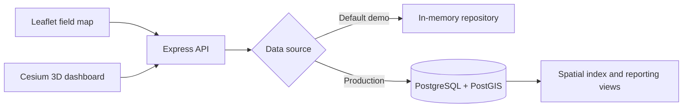

# QueueLens: Hospital Queue WebGIS

[](https://github.com/hyzhu711-oss/Hospital-queue-webgis/actions/workflows/ci.yml)
[](https://render.com/deploy?repo=https://github.com/hyzhu711-oss/Hospital-queue-webgis)

QueueLens is a full-stack WebGIS for crowdsourced hospital queue and cleanliness reporting. It combines a responsive Leaflet workflow for field reporting with a Cesium 3D dashboard, spatial search, report analytics and a PostgreSQL/PostGIS data model.

The public demo runs with synthetic in-memory data, so it has no UCL infrastructure or credential dependency. The same API can switch to a persistent PostGIS database through one environment variable.


## Highlights

- Queue-aware Leaflet markers with latest cleanliness observations and report history.
- Five-nearest-hospital search using browser geolocation and geodesic distance.
- Queue-status filtering, user contribution counts and rank calculations.
- Hospital creation and queue/cleanliness reporting with immediate map updates.
- Optional proximity prompt based on five consecutive readings within 25 metres.
- Cesium 3D hospital view linked to report tables and Chart.js text classification.
- PostgreSQL/PostGIS schema, spatial index, parameterised spatial queries and migrations.
- Memory-backed demo mode for zero-configuration previews and automated API tests.

## Architecture



The frontend and API are served from the same Express process. This removes the original Apache reverse-proxy dependency and keeps deployment, CORS and environment configuration straightforward.

## Technology

| Layer | Technology |
|---|---|
| Mapping | Leaflet, CesiumJS, OpenStreetMap and Esri basemaps |
| Visualisation | Chart.js |
| Backend | Node.js, Express |
| Spatial data | PostgreSQL, PostGIS, GeoJSON |
| Quality | Jest, Supertest, GitHub Actions |
| Delivery | Docker Compose, Render Blueprint |

## Quick Start

Requirements: Node.js 20 or later.

```bash
npm install
npm start
```

Open `http://localhost:3000`. Demo mode is the default and requires no database. Changes made through the interface persist until the process restarts.

## Run With PostGIS

The complete database-backed application can be started with Docker:

```bash
docker compose up --build
```

This starts PostGIS, applies the SQL migrations and seed data, and serves QueueLens at `http://localhost:3000`.

For an existing PostgreSQL/PostGIS service:

```bash
cp .env.example .env
# Set DATA_SOURCE=postgres and DATABASE_URL in .env
npm run migrate
npm start
```

The database scripts create four normalised tables, a GiST spatial index and two reporting views. Coordinates are stored as `geometry(Point, 4326)` and nearest-hospital queries use `ST_DistanceSphere` with parameterised inputs.

## API

| Method | Endpoint | Purpose |
|---|---|---|
| `GET` | `/api/health` | Service and data-source status |
| `GET` | `/api/user` | Current demo user |
| `GET` | `/api/queue-lengths` | Queue categories and colours |
| `GET` | `/api/hospitals` | User hospitals as GeoJSON |
| `GET` | `/api/hospitals/nearest` | Nearest hospitals to a coordinate |
| `GET` | `/api/hospitals/unknown` | Hospitals without a known queue |
| `GET` | `/api/hospitals/summary` | Queue distribution for charts |
| `GET` | `/api/hospitals/:id/reports` | Report history for one hospital |
| `GET` | `/api/users/:id/activity` | Contribution count and rank |
| `POST` | `/api/hospitals` | Create a mapped hospital |
| `POST` | `/api/reports` | Submit a queue and cleanliness report |

## Tests

```bash
npm test
npm run test:coverage
```

The test suite exercises GeoJSON responses, spatial ordering, validation, reporting activity, queue summaries and write-to-read consistency.

## Deployment

`render.yaml` deploys a public, zero-configuration demonstration using synthetic memory data. For persistent deployment, provision a PostGIS-compatible PostgreSQL database, run `npm run migrate`, and set:

```text
DATA_SOURCE=postgres
DATABASE_URL=<managed-postgres-connection-string>
DATABASE_SSL=true
```

No credentials are committed to the repository. `.env` files are ignored and only `.env.example` is versioned.

## Data and Coursework Note

All included hospital names, locations and reports are synthetic demonstration data. This repository is an independent portfolio reimplementation inspired by work completed for UCL CEGE0043; it removes UCL-specific services, credentials, schemas and assessment scaffolding. It is intended to demonstrate engineering and geospatial skills, not to provide material for assessed coursework.

## License

MIT License. Map tiles and third-party libraries remain subject to their respective licences and attribution requirements.
