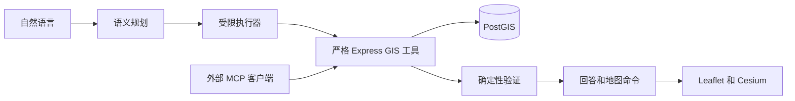
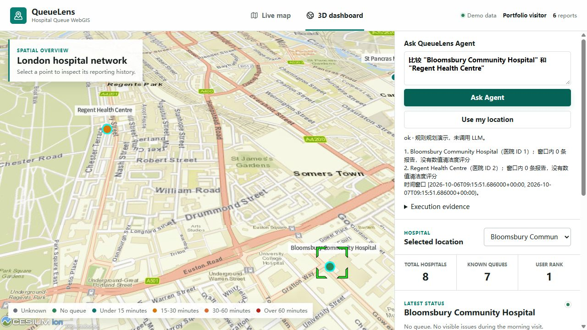

# QueueLens Agent

**面向医疗可达性的工具增强 Spatial AI Agent**

[English](README.md) | **简体中文**

```text
自然语言
   ↓
Spatial Agent
   ↓
Plan → GIS Tools → PostGIS → Verify
   ↓
有证据的回答 + 交互地图
```

在原 Hospital WebGIS 上新增严格 GIS 工具、独立 FastAPI Agent、确定性验证、地图命令、MCP 和可执行评测。LLM 提取语义与约束；PostGIS 和确定性程序计算空间与数据库事实。

**本地升级与真实模型实验已完成。** [原WebGIS演示](https://hospital-queue-webgis.onrender.com)尚未部署本次Agent升级。

## 真实模型实验（本阶段已完成）

deepseek-flash；dev 120、validation 60、冻结test 180。test四系统各三次独立推理，共2160条逐case结果，全部失败保留；120/120规则结果继续单列为Development / Regression Benchmark。

| System | 三次平均 E2E | Severe Error Rate |
|---|---:|---:|
| LLM Only | 27.22% | 62.22% |
| Text-to-SQL | 42.04% | 34.26% |
| Single-Step | 31.48% | 42.96% |
| Proposed | 93.15% | 0.56% |

本结果来自12家合成医院、45条报告与独立PostGIS oracle；unseen仅指相对于项目开发/validation未用于调参的语言与组合。三次均值、Pass@1、槽位准确率、一致性、token、权限差异、失败与限制见[中文实验报告](eval/reports/LLM_EXPERIMENT_RESULTS_ZH.md)。模型没有训练；原公共demo尚未部署本次升级。

[中文失败分析](docs/FAILURE_ANALYSIS_ZH.md) · [项目最终总结](docs/FINAL_PROJECT_SUMMARY_ZH.md) · [中文简历/面试材料](docs/RESUME_MATERIAL_ZH.md)

QueueLens 不提供医疗诊断、紧急程度判断或临床适宜性建议。

QueueLens 当前阶段开发冻结。后续仅进行必要 bug fix、依赖维护或针对实际岗位需求的小规模适配，不再继续增加 RAG、Multi-Agent 或其他非必要功能。


## 问题

“找 2km 内最近 24 小时平均排队较短、清洁度至少 4 分的三家医院”同时涉及空间范围、时间窗口、缺失观测、属性筛选和排序。回答还应直接驱动医院地图。

## 为什么 LLM-only GIS 不可靠

模型没有当前医院与报告表，也不能自行提供可信距离、包含关系、统计或排名。QueueLens 将语义计划转换成真实工具调用，保留来源，再验证结果；事实回答由确定性模板生成。

## 架构与实现状态



原有 11 个 REST API、repository、GeoJSON、上报、图表和地图保留。Python 服务独立部署；MCP 与 Agent 共用 Node 工具和 SQL。

| 阶段 | 本地实现 |
|---|---|
| P0 | 完整仓库审查、复用/API 映射、文件级实施计划 |
| P1 | 8 个严格工具、证据输出、增量字段与 geography 索引 |
| P2–P3 | 可配置 provider、Plan–Execute–Verify、会话指代、SSE 与调用上限 |
| P4 | 统一地图契约、两种地图 adapter、可选 Agent 面板 |
| P5 | 真实 stdio MCP Server 及协议测试 |
| P6 | 120 条独立 ground truth、确定性计分、baseline adapter、失败分类和 CI 配置 |
| P7 | 复现/部署文档、实际 trace、截图和依赖锁 |

CI 与 Docker 文件已经配置；远程 Actions 执行、容器构建和线上发布没有被描述为已完成。[审查报告](docs/REPOSITORY_AUDIT.md) · [完整架构](docs/ARCHITECTURE.md)

## 示例执行链

```text
找2000米以内最近24小时平均排队较短、清洁度至少4分的三家医院
→ search_nearby_hospitals：PostGIS 距离和半径
→ rank_hospitals：窗口聚合 → 筛选 → 排名
→ verify：来源、时间、候选、阈值和完整候选排序
→ 回答 + filter / fit_bounds / highlight / rank / open_popup
```

[真实本地合成数据 trace](docs/EXAMPLE_TRACE.json)从 PostGIS 规则模式评测提取。“第二个过去24小时怎么样”解析先前已验证的结果顺序，并重新执行详情/统计工具。

## 空间工具

| 工具 | 能力 |
|---|---|
| resolve_hospitals | 精确优先的名称解析、歧义返回 |
| search_nearby_hospitals | 椭球距离、最近/半径查询、完整性标记 |
| get_hospital_details | 医院与最新观测 |
| get_hospital_reports | 明确时间窗口内的报告 |
| get_queue_statistics | 排队等级与真实报告分钟、样本量 |
| get_cleanliness_statistics | 数值评分与样本量 |
| compare_hospitals | 同一窗口批量比较 |
| rank_hospitals | 先筛选再 top-k 的确定性加权排名 |

`GET /api/tools/catalog` 返回共享 schema，`POST /api/tools/:name` 执行白名单工具。每个结果保存参数、来源、空间方法、时间窗口及证据。上报可填写数值清洁度和实际等待时间；历史文字不会被猜成分数。[工具契约与公式](docs/SPATIAL_TOOLS.md)

## 地图交互

统一 schema 支持 fit_bounds、highlight、filter、rank、compare、open_popup、fly_to。整批命令验证通过后才执行，ID 必须属于最终已验证实体。跨页面仅保存不透明会话编号，不重放浏览器缓存中的旧事实。



[地图行为与浏览器实测](docs/MAP_ACTIONS.md)

## MCP

```bash
python -m pip install -r mcp/requirements.txt
python mcp/server.py
```

设置 `GIS_API_URL` 指向可信 Node API。MCP 不复制业务计算、不提供写入或任意 SQL；协议测试覆盖初始化、目录、全部 8 个工具与非法请求。[客户端配置](docs/MCP.md)

## Benchmark 与 baseline

固定 12 家合成医院、45 条显式观测、120 条问题、13 个类别。独立 oracle 读取原始数据库记录与 PostGIS 距离，不调用 Agent 工具。报告包含工具选择/参数、执行、约束、实体、答案事实、地图、端到端、延迟与调用次数。

**规则模式 PostGIS 工作流检查：120/120；单工具规则模式：50/120。** 这验证已知模板下的软件工作流，不能代表 LLM 空间推理或未见语言泛化能力。[实际结果](eval/reports/RESULTS.md) · [计分口径与复现](docs/EVALUATION.md)

四系统的真实模型实验已完成，见上方结果及[完整中文报告](eval/reports/LLM_EXPERIMENT_RESULTS_ZH.md)。A无数据库访问，B使用受限SQL与固定投影，C只允许一个GIS调用，D执行Plan–Execute–Verify；实验比较包含这些能力差异，不是纯模型推理优劣。

## 失败分析

[失败分类与代表案例](docs/FAILURE_ANALYSIS.md)记录解析、参数、空间/时间、工具、空结果、指代、校验、事实、地图与循环错误。浏览器发现的 Python/Node 时间精度问题及修复有明确回归测试。

## 部署

原 WebGIS：

```bash
npm ci
npm start
docker compose up --build
```

Agent 使用 Python 3.12，安装 `agent-service/requirements.lock.txt`，显式设置服务变量；模型变量可由本地 `agent-service/.env` 加载，进程变量优先，在 `agent-service` 目录启动 `python -m uvicorn app.main:app --host 127.0.0.1 --port 8000`。Node 设置 `AGENT_SERVICE_URL` 后重启。默认 `http_chat` 需要三个 LLM 配置变量；零 key 演示显式设置 `PLANNER_PROVIDER=rules`。

```bash
docker compose -f docker-compose.yml -f docker-compose.agent.yml --profile agent up --build
```

未设置 Agent URL 时隐藏面板；模型密钥和服务 token 不进入浏览器。[完整配置及部署限制](docs/DEPLOYMENT.md)

## 复现

完整测试环境安装根目录 `requirements.lock.txt`：

```bash
npm test
# agent-service 目录
python -m pytest tests -q
# 仓库根目录
python -m pytest eval/tests -q
python eval/evaluator.py --store memory --offline --require-smoke-pass --output eval/reports/run-memory.json
```

真实 PostGIS 评测只使用 queuelens_test / queuelens_eval 隔离数据库和非特权 reader。[数据库复现步骤](docs/EVALUATION.md) · [实测记录](docs/VALIDATION.md)

## 限制与 future work

- 合成/众包观测，直线距离不是交通时间；不提供临床建议，不推断缺失观测或实时可用性。
- 规则规划器词汇有限，仅用于演示与回归；真实模型合成test结果不代表真实用户泛化或医疗收益。
- 跨工具统一快照、共享会话存储、公开配额与远程MCP认证为已知技术债；当前开发冻结，不继续扩展功能。
- 未实现路由、多边形、科室、急诊判断、文档 RAG、模型训练、World Model 或复杂 Multi-Agent。
- 底图依赖外部服务；Docker、远程 CI 和生产发布还需在目标环境执行验证。

## 项目来源与许可

原 WebGIS 是受 UCL CEGE0043 启发的独立工程作品，使用合成医院与报告。Agent 升级复用这一工程基础。MIT License；地图、第三方库及服务需保留各自许可与归属信息。
