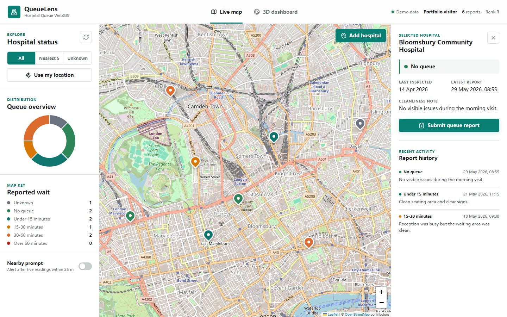
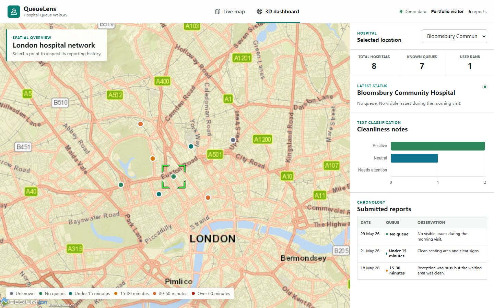
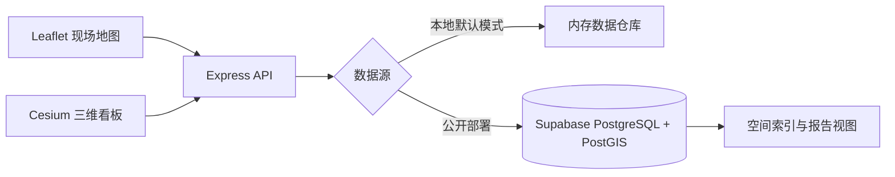

# QueueLens：医院排队 WebGIS

[English](README.md) | **简体中文**

[](https://github.com/hyzhu711-oss/Hospital-queue-webgis/actions/workflows/ci.yml)
[](https://render.com/deploy?repo=https://github.com/hyzhu711-oss/Hospital-queue-webgis)

**在线演示：** [hospital-queue-webgis.onrender.com](https://hospital-queue-webgis.onrender.com)

QueueLens 是一个用于众包医院排队时长和环境清洁度上报的全栈 WebGIS。项目将面向现场采集的 Leaflet 响应式地图、Cesium 三维看板、空间邻近查询、报告分析和 PostgreSQL/PostGIS 数据模型整合为一个可公开部署的应用。

在线演示使用 Supabase PostgreSQL/PostGIS 持久化存储合成医院与报告数据，不依赖 UCL 的服务器、数据库账号或课程 schema；本地开发仍可使用内存模式零配置运行。





## 核心功能

- 在 Leaflet 地图中按最新排队状态着色展示医院，并查看清洁度记录和历史报告。
- 使用浏览器定位和空间距离计算查询距离用户最近的 5 家医院。
- 筛选排队状态未知的医院，统计用户上报数量和贡献排名。
- 支持地图选点新增医院，并实时提交排队时长与清洁度报告。
- 基于连续 5 次定位结果判断用户是否进入医院 25 米范围并触发上报提示。
- 使用 Cesium 构建三维医院分布看板，联动报告表格和 Chart.js 文本分类图表。
- 使用 PostgreSQL/PostGIS 管理空间数据，包含 GiST 空间索引、参数化空间查询和数据库迁移。
- 提供内存演示与 PostGIS 持久化两种数据模式，便于在线展示和本地复现。

## 系统架构



前端静态资源和 API 由同一个 Express 进程提供，从而移除了原项目对 Apache 反向代理的依赖，并简化了 CORS、环境变量和 Render 部署配置。

## 技术栈

| 层级 | 技术 |
|---|---|
| 地图与三维可视化 | Leaflet、CesiumJS、OpenStreetMap、Esri Basemap |
| 数据图表 | Chart.js |
| 后端服务 | Node.js、Express |
| 空间数据库 | PostgreSQL、PostGIS、GeoJSON、Supabase |
| 测试与质量 | Jest、Supertest、GitHub Actions |
| 部署与复现 | Docker Compose、Render Blueprint |

## 快速开始

运行环境要求：Node.js 20 或更高版本。

```bash
npm install
npm start
```

打开 `http://localhost:3000`。默认使用内存演示数据，无需安装数据库；通过页面新增的医院和报告会保留到 Node.js 进程重新启动之前。

## 使用 PostGIS

可以通过 Docker 启动完整的数据库版本：

```bash
docker compose up --build
```

该命令将启动 PostGIS、执行数据库迁移与演示数据初始化，并在 `http://localhost:3000` 提供 QueueLens。

连接现有 PostgreSQL/PostGIS 或 Supabase 项目时：

```bash
cp .env.example .env
# 在 .env 中设置 DATA_SOURCE=postgres 和 DATABASE_URL
npm run migrate
npm start
```

迁移脚本创建 4 张规范化数据表、1 个 GiST 空间索引和 2 个报告视图。医院坐标以 `geometry(Point, 4326)` 保存，最近医院查询通过参数化的 `ST_DistanceSphere` 完成。数据库连接同时支持 PostGIS 位于 `public` 或 `extensions` schema 的环境。

## API 接口

| 方法 | 接口 | 功能 |
|---|---|---|
| `GET` | `/api/health` | 检查服务及数据库连接状态 |
| `GET` | `/api/user` | 获取当前演示用户 |
| `GET` | `/api/queue-lengths` | 获取排队等级及颜色 |
| `GET` | `/api/hospitals` | 以 GeoJSON 返回用户医院 |
| `GET` | `/api/hospitals/nearest` | 查询距离指定坐标最近的医院 |
| `GET` | `/api/hospitals/unknown` | 查询排队状态未知的医院 |
| `GET` | `/api/hospitals/summary` | 获取排队状态统计数据 |
| `GET` | `/api/hospitals/:id/reports` | 获取单家医院的报告历史 |
| `GET` | `/api/users/:id/activity` | 获取用户贡献数量与排名 |
| `POST` | `/api/hospitals` | 新增地图医院点位 |
| `POST` | `/api/reports` | 提交排队及清洁度报告 |

## 自动化测试

```bash
npm test
npm run test:coverage
```

测试覆盖 GeoJSON 结构、空间距离排序、输入校验、用户贡献统计、排队状态汇总，以及写入后立即读取的一致性。

## 部署

`render.yaml` 用于部署 Node.js Web Service，服务启动前会自动执行可重复运行的数据库迁移。在线环境使用 Supabase PostgreSQL/PostGIS，并通过 Render 环境变量注入数据库连接：

```text
DATA_SOURCE=postgres
DATABASE_URL=<Supabase 数据库连接字符串>
DATABASE_SSL=true
```

数据库密码和连接字符串不会提交到 GitHub。仓库忽略所有 `.env` 文件，仅保留不含真实密钥的 `.env.example`。

Render 免费实例长时间无访问后会休眠，因此首次打开在线演示时可能需要等待服务唤醒。

## 数据与课程说明

仓库中的医院名称、坐标和报告均为合成演示数据。本项目是在 UCL CEGE0043 课程实践基础上完成的独立作品集重构，已经移除 UCL 专用服务、凭据、数据库 schema 和作业模板。该仓库用于展示全栈与地理空间开发能力，不应作为任何课程考核的参考答案。

## 开源许可

项目采用 MIT License。地图瓦片和第三方库仍遵循各自的许可与署名要求。
