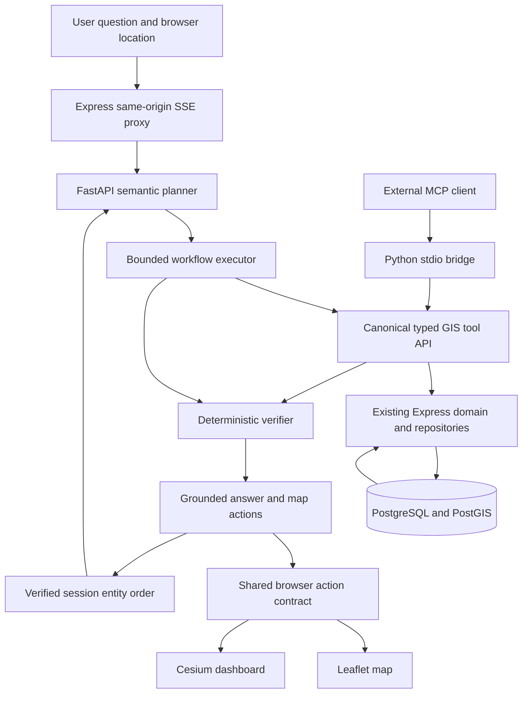

# QueueLens Agent architecture

**A Tool-Augmented Spatial AI Agent for Healthcare Accessibility.** The existing WebGIS remains the domain application. This extension adds semantic planning, deterministic GIS tools, verification, map commands, MCP, and executable evaluation.

## Component ownership

| Component | Responsibility | Facts it may compute |
|---|---|---|
| LLM provider | Extract intent, named entities, radius, time window, filters, weights | None from the database |
| FastAPI executor | Compile supported intent to a bounded workflow, call tools, retain trace | Time bounds from explicit clock and validated duration |
| Express tools | Enforce shared input/output schemas, serialize evidence, combine existing domain operations | Deterministic statistics and declared ranking formula |
| PostGIS store | Parameterized geography distance, radius membership, temporal selection and aggregates | Spatial/database facts |
| Verifier | Check source identity, candidate membership, windows, thresholds, complete ranking evidence | Recompute ranking from returned evidence |
| Renderer | Format verified facts into text | Formatting only |
| Map adapters | Execute validated IDs/actions | View transforms only |
| MCP bridge | Reuse catalog and ToolClient | No separate GIS implementation |
| Evaluation oracle | Read raw records and PostGIS distances independently | Ground truth, without calling agent tools |

## Existing application preserved

All eleven legacy REST endpoints remain. The old `/api/hospitals` layer is contributor-scoped; agent tools search the global hospital table. Leaflet/Cesium adapters therefore add verified hospitals that are absent from the old layer. Legacy nearest uses `ST_DistanceSphere`; the new tools use `ST_Distance(geography)` and indexed `ST_DWithin(geography)`.

Tables and existing views are retained. Migration 003 adds nullable numeric cleanliness and observed wait fields plus a geography expression GiST index. No historic text or wait category is converted into a fabricated numeric observation. The reporting form optionally collects these actual values.

## Execution and evidence

Each tool envelope contains version, tool, arguments, typed data, request ID, data source, spatial method, generation time, duration and explicit `[start,end)` evidence. PostGIS uses a read-only repeatable-read transaction **per tool call**, not a single transaction across an entire conversation. In-memory mode is a labelled synthetic spherical-distance demo.

An invalid plan, malformed tool result, missing metric, ambiguous name, stale session, oversized candidate set or failed verification produces explicit failure/no-result output. No unverified map entities are sent to the browser. Unknown numeric values remain null.

## Boundaries

No document RAG, vector database, trained reasoning model, world model, routing engine or multi-agent application is implemented. Polygon containment, travel times, departments and emergency care are unsupported. Redis/persistent sessions, remote MCP OAuth, broader semantic benchmarks and whole-workflow database snapshots are future work.

See [repository audit](REPOSITORY_AUDIT.md), [tool contracts](SPATIAL_TOOLS.md), [agent design](AGENT_DESIGN.md), [evaluation](EVALUATION.md), and [deployment](DEPLOYMENT.md).
