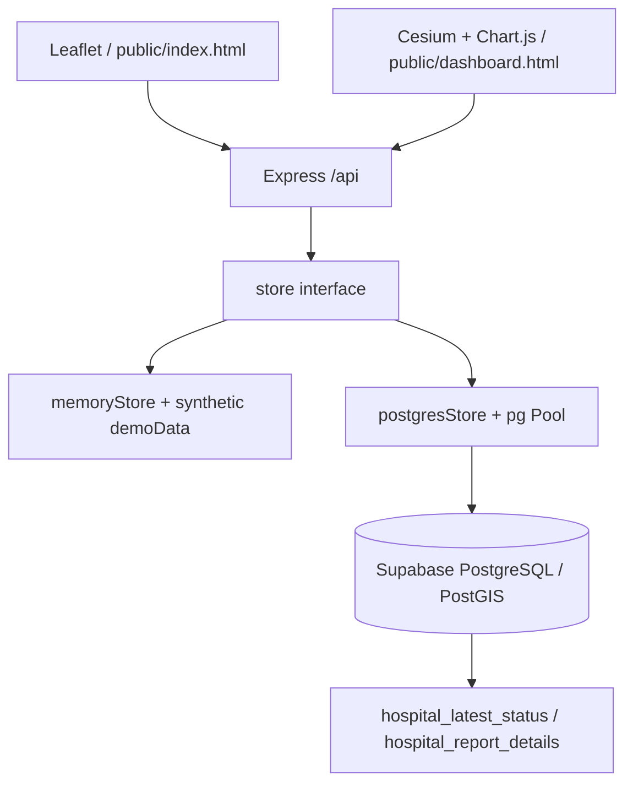

# QueueLens P0 仓库审查

审查日期：2026-10-04。基线提交：`72952e9`（`main`）。审查涵盖全部业务源码、前端、数据库迁移、测试、锁文件、部署配置和已有截图。开始时工作区干净。此报告记录升级前状态，P1–P6 的条目是实施计划，不代表已经完成。

## 1. 当前架构



- `src/server.js` 负责环境变量、启动和关闭；`src/app.js` 同时提供静态资源及 API。
- `src/routes/api.js` 中有 11 个路由。没有独立 domain service、Agent、MCP 或工具注册表。
- `src/store/index.js` 根据 `DATA_SOURCE` 选择内存或 PostgreSQL；现有双实现接口是主要复用边界。
- 两个地图页面共享 REST 数据，但各自维护选择状态；目前没有跨页面会话联动或统一 map action。
- Docker Compose 含数据库、迁移、Node 应用三个服务。Render Blueprint 启动前执行迁移。生产服务和 Supabase 实例本次未连接、未修改；配置不能证明线上运行状态。

## 2. 可直接复用的模块

| 模块 | 复用方式 | 注意事项 |
|---|---|---|
| `src/app.js`、`src/server.js` | 继续承载现有 WebGIS；增加独立工具路由和可选 Agent 代理 | 保留原路由及默认启动方式 |
| `src/store/index.js` | 共用存储选择机制 | 新工具能力必须同时实现两种 store |
| `src/store/postgresStore.js` | 保留连接池、参数化 SQL、现有读写接口 | 增加真实 PostGIS 查询和集成测试 |
| `src/store/memoryStore.js`、`src/data/demoData.js` | 本地零配置演示、快速测试 | 必须标注 memory 距离方法，不能冒充 PostGIS |
| `src/utils/geo.js` | GeoJSON 输出、演示距离辅助函数 | 工具过滤使用未舍入距离 |
| `database/migrations/001_init.sql` | 四张表、视图、已有索引 | 用增量迁移，不覆盖旧报告 |
| `public/js/app.js` | 定位、标记、医院详情、上报、图表 | 增加适配器，不重写原地图 |
| `public/js/dashboard.js` | Cesium 实体 ID 索引、选择和 flyTo | 文本分类不是评分，不能用于“至少 4 分” |
| Jest / Supertest / GitHub Actions | 现有 API 回归基线 | 增加数据库、Agent 和地图测试 |

## 3. 需要新增的模块

- `contracts/`：GIS 工具输入/输出及 map action 的版本化 JSON Schema。
- `src/domain/`、`src/tools/`：确定性统计、评分、工具注册、验证、证据和错误封装；业务计算仍在 Node/PostGIS。
- `agent-service/`：FastAPI、可替换 provider、Planner → Executor → Verifier → Response Generator、自有状态机、会话和 SSE。
- 地图适配器及可选 Agent 查询界面；Leaflet/Cesium 共享命令，分别执行。
- `mcp/server.py`：共享 Agent 的 HTTP 工具客户端；不复制 SQL 和排名算法。
- `eval/`：独立 fixture、固定时钟、可执行 oracle、120 条查询、确定性评分及三种 baseline。
- 增量迁移、PostGIS CI、Python CI、部署配置和设计文档。

## 4. 现有 API → Agent Tool 映射

| 当前能力 | 拟新增工具 | 差距 |
|---|---|---|
| `GET /api/hospitals` → `listHospitalsByUser` | `resolve_hospitals` | 增加名称/ID 查找、重名处理；显式区分全局公开数据与用户列表 |
| `GET /api/hospitals/nearest` → `listNearestHospitals` | `search_nearby_hospitals` | 增加可选半径、原始距离、稳定排序及候选完整性说明；无半径支持 nearest |
| 最新状态视图；没有单医院详情路由 | `get_hospital_details` | 新增按 ID 读取，保留报告来源和更新时间 |
| `GET /api/hospitals/:id/reports` | `get_hospital_reports` | 增加带时区的 `[start,end)`、分页/上限及不存在医院处理 |
| 排队类别、报告历史；summary 仅统计最新状态 | `get_queue_statistics` | 增加窗口聚合、分布、有效样本数、Unknown 排除和趋势 |
| 自由文本 cleanliness | `get_cleanliness_statistics` | 增加可空的数值评分及覆盖率；不能从旧文本猜评分 |
| 多医院历史记录 | `compare_hospitals` | 批量、同窗口聚合，缺失指标明确返回 null |
| 最近距离 + 类别 + 新评分 | `rank_hospitals` | 在完整候选集上先过滤后排序；权重、版本、缺失值规则透明 |
| Unknown 医院 | 后续按需扩展 underreported 查询 | Unknown 不等于低报告覆盖，第一版不盲目增加工具 |
| 创建医院/报告 | 不向 Agent 暴露写工具 | 保留现有人工上报流程 |

新增工具路由不能只包装原 REST 响应：原 API 缺少半径和时间参数，工具应调用扩展后的同一存储/domain 实现。

## 5. 数据库可支持的查询

| 对象 | 当前字段/索引 | 可支撑能力 |
|---|---|---|
| `users` | ID、display_name、created_at | 贡献者查找及统计 |
| `queue_lengths` | description、colour、sort_order | 等级分布；不是精确分钟 |
| `hospitals` | ID、name、last_inspected、`geometry(Point,4326)`、user_id | 位置、直线距离、半径查询；没有科室/容量/路线信息 |
| `reports` | 医院、贡献者、排队类别、清洁度文本、timestamptz | 历史查询、时间窗口、按医院聚合 |
| GiST(location) | geometry 索引 | 当前 nearest SQL 全量计算距离后排序，没有索引筛选谓词 |
| B-tree(hospital_id,created_at DESC) | 时间索引 | 单医院窗口查询 |
| B-tree(user_id) | 贡献索引 | 贡献计数 |
| 两个 reporting views | 最新状态、完整报告 JOIN | 展示和详情复用 |

`ST_DistanceSphere` 返回球面米制距离，现有 API 将其取整。新增工具拟统一使用 geography 的米制距离与 `ST_DWithin`，并增加与 geography 表达式匹配的索引；是否使用索引要以真实 `EXPLAIN` 为证据，不能仅凭索引存在宣称性能提升。[PostGIS ST_DWithin](https://postgis.net/docs/ST_DWithin.html)、[ST_DistanceSphere](https://postgis.net/docs/ST_DistanceSphere.html)。

## 6. 当前缺失能力与已确认问题

1. **清洁度评分缺失**：只有文本，不能回答数值门槛。新增 `cleanliness_score`（1–5，可空），旧数据保留 null。
2. **精确等待时间缺失**：类别包含开放区间 `Over 60 minutes`。类别统计/严重度不能称为平均等待分钟。可新增 `queue_wait_minutes`（可空、明确为贡献者报告值）。
3. **无半径过滤、时间窗口、批量比较/排名、名称解析、证据、Agent、MCP、benchmark。**
4. **弱输入校验（实测）**：`lat=&lon=` 得到 `(0,0)` 并返回 200；`/hospitals/1abc/reports` 当作 ID 1；内存接受 501 字符文本及非法日期。
5. **存储语义不一致（实测 + SQL 审查）**：不存在 user 999 在内存返回 user 1，数据库返回 null；贡献数 `[6,4,4]` 内存排名 `[1,2,3]`，SQL `RANK()` 应为 `[1,2,2]`（数据库预期由源码推导，未在数据库执行）。
6. **稳定排序缺失**：内存最新报告只按时间；SQL 最新视图按时间、ID。nearest 及历史列表的并列排序也需统一。
7. **报告无界**：历史查询无分页/时间范围；陌生医院 ID 返回空列表，与存在但无报告的医院不区分。
8. **种子过期**：14 条报告在 2026-05-18 至 2026-05-29；在 2026-10-03T00:00Z 至 2026-10-04T00:00Z 的窗口中为 0 条。不能改报告日期伪装成实时数据。
9. **迁移没有 ledger/整体事务**：每次重跑全部 SQL；seed 的 upsert 会重置种子医院/用户字段。新增视图列后重跑旧 `CREATE OR REPLACE VIEW` 还可能冲突。迁移版本记录必须先于新增 schema 部署。
10. **安全/运维边界**：演示 API 无认证；Agent 必须只读、有工具白名单和资源上限。TLS 配置 `rejectUnauthorized:false`；没有数据库语句超时。CSP 被关闭，CDN/瓦片/WebGL 是地图运行依赖。
11. **文本分类有误导性**：看板的关键词函数将 `not clean` 分类成 Positive（实测），只可保留为原展示，不能变成权威评分。
12. **并发一致性**：跨工具查询可能看到不同数据库状态。比较/排名应批量在同一查询/只读事务中取得指标；trace 记录 as_of 和来源，不能声称任意 HTTP 调用共享快照。

## 7. P0–P6 修改计划及涉及文件

| 阶段 | 具体修改 | 主要文件（尚未实施） | 阶段验收 |
|---|---|---|---|
| P0 | 完整审查、基线测试、问题探测、计划 | 本报告 | 现有 API/GeoJSON 测试；静态资源；验证边界明确 |
| P1 | 严格 schemas、8 个只读工具、证据；增量字段/索引；修复影响工具的存储不一致 | `contracts/`、`src/domain/`、`src/tools/`、`src/routes/tools.js`、两种 store、`003_agent_tools.sql`、`scripts/migrate.js`、`tests/tools.test.js`、数据库集成测试 | 原 18 条全通过；每工具有效/非法输入、半径边界、窗口边界、null、稳定排名、SQL 参数化、数据库 parity |
| P2 | 独立 FastAPI、provider 接口、受限计划/真实工具执行、模板化事实回答；可选 Express 代理 | `agent-service/app/{api,agent,schemas,providers,tools}/`、`requirements.txt`、`tests/`、`src/routes/agent.js`、环境示例 | mock provider 只用于控制测试；真实 Node 工具端到端；没有 key 时明确未配置，不假装调用模型 |
| P3 | 显式 Plan–Execute–Verify、多步依赖、trace、会话引用、失败处理与 SSE | `planner.py`、`executor.py`、`verifier.py`、`state.py`、`graph.py`、会话及安全测试 | 约束和 ID 故意篡改应失败；第二个引用、超时、调用上限、prompt injection、空结果、过期会话 |
| P4 | 统一 map action schema、Leaflet/Cesium adapter、可选 Agent 面板 | `contracts/map-actions.schema.json`、`public/js/map-actions.js`、`agent-ui.js`、两地图 JS/HTML、样式、地图测试 | fit/highlight/rank/popup/filter/compare/fly；未知 ID/动作拒绝；原定位、创建、上报、历史、图表回归 |
| P5 | MCP 共享工具客户端和 catalog；同一 Node domain 为唯一业务计算实现 | `mcp/server.py`、MCP 依赖/测试、`docs/MCP.md` | catalog/参数/证据与内部 Agent 一致；协议 smoke；不复制业务算法 |
| P6 | 120 条确定性 benchmark、独立 oracle、A/B/C baseline、指标、失败分类、CI | `eval/{benchmark,baselines,reports}/`、`evaluator.py`、`metrics.py`、`.github/workflows/ci.yml`、`docs/EVALUATION.md`、`docs/FAILURE_ANALYSIS.md` | 固定 fixture 和时钟；数据库 ground truth；离线回归与真实 provider 实验分开；未执行 baseline 标记 skipped |

P7 收尾更新两份 README、架构图、示例 trace、复现/部署说明；P2 起就记录架构及 Agent 设计，不等 P7 才写文档。

## 8. 工具和 Agent 的实施约束

- JSON Schema 拒绝多余参数、字符串冒充数值、布尔值冒充 ID、NaN、越界坐标、无时区时间、负半径和无效权重。
- 每次工具响应有 `tool`、`arguments`、`data`、`evidence`、`warnings`；保留数据模式、方法、查询窗口、报告 ID、样本数和数据时间。详细列表设置上限并暴露是否完整。
- 半径使用未经舍入的米值；时间采用 UTC `[start,end)`。Unknown、缺评分、过期数据不能当作最佳指标。
- 先过滤再 top-k。候选被截断时不得声称是全半径最优；超过执行预算明确返回限制。
- 排名由确定性 domain 计算，权重非负且和为 1；距离原点必须是真实请求位置。算法版本、归一化尺度、缺失数据排除原因可追溯。
- LLM 只生成语义约束和允许的计划；运行时无 SQL 工具、写工具或任意 URL。Name/notes 是不可信数据，不能修改工具授权。
- 初始限制拟设为 query 4000 字符、12 planning steps、24 tool calls、每工具 5 秒、整次执行 30 秒；所有限制可配置且失败进入 trace。
- Response Generator 默认按 verified facts 用确定性模板形成事实句，避免只校验 JSON 却遗漏自由文本里的虚构数字。
- 会话仅保存已验证、有序的结果 ID 和上下文；限定 TTL、轮数、所有权。失败轮次不覆盖上次 verified referents；多实例部署不能依赖无界进程内会话。

## 9. Benchmark 与 baseline 设计

拟生成 **120 条**：lookup 10、nearest 10、radius 10、attribute 8、spatial+attribute 10、temporal 10、ranking 10、comparison 10、multi-step 12、follow-up 10、ambiguous 6、no-result 8、invalid 6。

- fixture 与线上 seed 分离；含数值评分、报告时间边界、同距离/同分并列、Unknown、无报告、重名和不满足条件的医院。
- ground truth 从原始 fixture/数据库独立计算；不能将被测 Agent 的返回值当答案，不能只用同一排名函数测自己。
- cases 保存 query、location、clock、conversation turns、允许的工具组合、规范化参数、约束、最终有序/无序 ID 和 map actions。
- 指标：工具选择、参数、执行、约束、最终实体、事实 groundedness、地图动作、端到端成功率；latency median/p95、调用数、token/provider cost（有记录才报告）。
- 模糊/非法/无结果样例按正确状态评分；各指标分母与不适用样例明确，不将缺失测量记为 0。
- A：LLM-only，不访问工具；B：Text-to-SQL，仅临时评测库和 SELECT-only 独立角色，AST/关系/函数白名单、行数与超时上限；C：没有显式规划/验证的单步工具。相同 fixture、query/context、provider/model 配置。
- SQL baseline 不能只靠 `SELECT` 前缀或 `READ ONLY` 保护，更不能使用生产 app 账号。只读事务是补充约束，不是完整隔离。[PostgreSQL transactions](https://www.postgresql.org/docs/16/sql-set-transaction.html)。
- CI 的 mock/offline 测试证明确定性流程回归，不证明真实模型自然语言能力；真正的 provider 实验需要单独执行、保存版本和原始 trace。
- 失败分类按请求中的 taxonomy：intent、tool selection、argument、temporal/spatial、missing tool、execution、empty result、reference、verification、grounding、map、loop。只记录实际案例，不预填虚构实验。

## 10. 实际运行的测试与验证边界

环境：Windows，Node `v24.19.0`；仓库要求 Node >=20、CI 为 Node 20。系统 npm 不在 PATH，本次使用临时 npm 10.9.4 按 `package-lock.json` 安装依赖，未修改锁文件；安装关闭生命周期 scripts。

```text
node node_modules/jest/bin/jest.js --runInBand --coverage
2 suites passed; 18 tests passed
Statements 90%; Branches 67.74%; Functions 97.05%; Lines 91.9%
```

覆盖配置明确排除 `src/store/postgresStore.js`，不覆盖地图浏览器代码；这不是全栈 90% 覆盖率。另通过临时 Supertest 探测验证 `/`、`/dashboard.html`、两个 JS 及 CSS 均返回 200，前端 JS 语法检查通过。问题探测仅修改独立内存实例。

本机未发现 Docker/psql，没有运行 PostgreSQL/PostGIS、迁移、Docker 构建、浏览器地图渲染或线上回归；已查看仓库截图，它们是历史素材，不能代替当前浏览器验证。现有应用代码在 P0 未修改。

## 11. 风险和技术债的优先级

| 优先级 | 风险 | 处理阶段 |
|---|---|---|
| 高 | 缺评分、区间假装分钟、种子过期导致虚构事实 | P1 数据含义、null 和 coverage；P2/P3 verifier；P6 独立 fixture |
| 高 | 先截断附近候选再排名造成错误“最优” | P1 完整性协议和筛选顺序；P3 验证 |
| 高 | 迁移反复 seed/重定义 view；线上 schema 回归 | P1 ledger、事务、重复迁移与升级路径测试 |
| 高 | 薄弱参数验证及两 store 语义不一致 | P1 strict schemas、共同测试用例 |
| 高 | Agent 循环、prompt injection、未验证的文字/地图 | P2/P3 授权边界和资源限制；P4 动作白名单 |
| 高 | 数据库真实执行完全未覆盖 | P1/P6 PostGIS CI 和 oracle |
| 中 | 演示写 API 无认证、TLS 证书校验关闭 | 限制新增 Agent 为只读；记录现有 demo 边界，TLS 修复独立验证 |
| 中 | SSE、Render 单/双服务、Python 部署及会话丢失 | P2/P3 可选同源代理；P6/P7 Docker/部署验证 |
| 中 | CDN、瓦片/WebGL、地图事件竞争 | P4 adapter/浏览器测试；保留原地图入口 |
| 中 | 基准训练/测试模板重叠、oracle 与实现共错 | P6 独立 oracle、held-out 表述、provider 对照与完整 trace |

数据仍是合成众包观测，距离是直线距离；系统没有路线、诊疗能力或临床结局数据。未来能力必须在文档中标为 future work。
