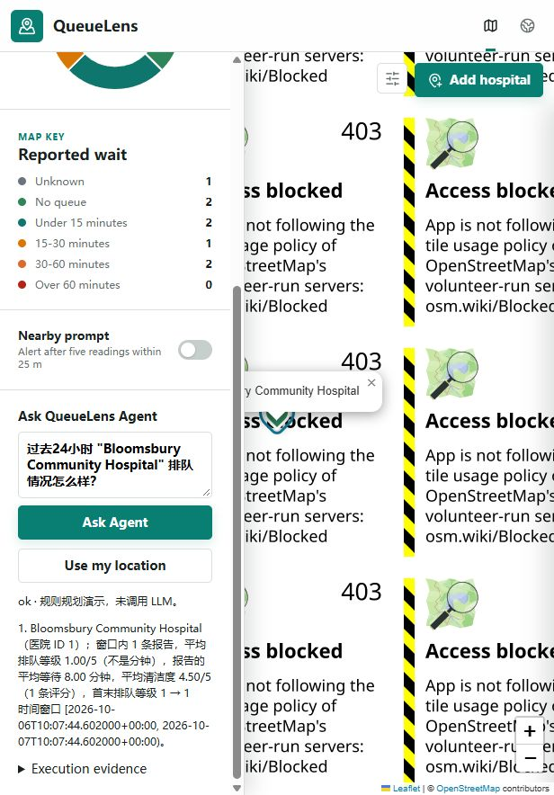

# 最新本地验证记录

2026-10-07，Asia/Shanghai；Windows、Node24.19.0、Python3.12.10、PostgreSQL16.15、PostGIS3.6.2。仅本机隔离合成数据库与临时服务。

## 最终实际运行

| 检查 | 结果 | 范围 |
|---|---|---|
| Node/Jest | 59 passed，6 suites，无跳过 | 原REST、GeoJSON、上报、空间查询、严格工具、代理与地图契约；真实PostGIS |
| Agent/MCP pytest | 31 passed | 计划、执行、篡改事实/排名验证、超时/会话/SSE、真实stdio MCP、mock模型重试/截断/配置脱敏 |
| Evaluation pytest | 28 passed | 独立oracle、评分、SQL安全与非特权数据库读、benchmark划分、空结果复合路径、事实/格式/错窗口分离 |
| migration verification | 通过 | fresh/repeated/legacy adoption；保留自定义医院和报告，临时数据库删除 |
| PostGIS规则回归 | 120/120；single-step rules50/120 | 最新eval/reports/regression-final.json；不是模型成绩 |
| 真实模型validation | 60×4×3=720结果 | 原始与重计分输出均保留 |
| 冻结真实模型test | 180×4×3=2160结果 | 同一deepseek-flash、fixture/时钟、固定shuffle；全部失败保存 |

118项自动测试、迁移检查、规则benchmark和模型推理是不同计量单位，不相加形成accuracy。provider单元测试使用mock transport；真实模型请求来自实验入口。

[真实模型结果](../eval/reports/LLM_EXPERIMENT_RESULTS_ZH.md) · [阶段记录](EXPERIMENT_STAGE_ZH.md) · [完整性/密钥检查](../eval/reports/FINAL_INTEGRITY_CHECK.json)

## 仅静态检查

Python AST、JavaScript node --check、两个Python依赖锁、文档链接、Git diff空白及workflow/Compose YAML。具体扫描数量随文档/分析脚本增加，由最终扫描终端结果记录。YAML解析不意味着容器或Actions已经执行。

## 历史浏览器验证（本阶段未新增地图功能）

## Actual browser checks

- Leaflet hospital lookup, marker/popup, details and report history remained usable.
- A synthetic report with optional cleanliness score 4.5 and actual waiting time 8 minutes was saved through the original form. A fresh Agent temporal query returned one in-window report with those aggregates.
- Cesium comparison rendered verified hospitals, highlighting and camera navigation; comparison statistics correctly had zero reports in the current window over older seed dates.
- Invalid ordinal requests and expired sessions returned explicit errors instead of invented hospitals. Python/Node submillisecond window mismatch found in the browser was fixed and covered by a regression test.
- Browser fact replay was removed; cross-page persistence retains only an opaque session identifier. Location tests use synthetic coordinates. No actual user location permission was accepted.

External OpenStreetMap tiles were blocked at one zoom in this environment. Mobile breakpoints, every map/provider combination and location-permission acceptance were not specifically tested.

## 明确未运行

- Docker镜像/Compose构建：机器无Docker runtime。
- Linux兼容运行：没有可用WSL发行版或Linux测试环境。
- 远程GitHub Actions：仅解析配置，并在本机执行对应核心测试；不能据此声称Node20/PostGIS3.4平台已验证。
- Render/Supabase生产迁移、公共demo升级、生产负载/配额、真实医院数据验证。

没有push、生产部署或生产数据库更新。模型/数据库密钥未进入非忽略文件，原始实验已脱敏。临时本地服务在收尾时停止；停止后的端口证据单独保存。
